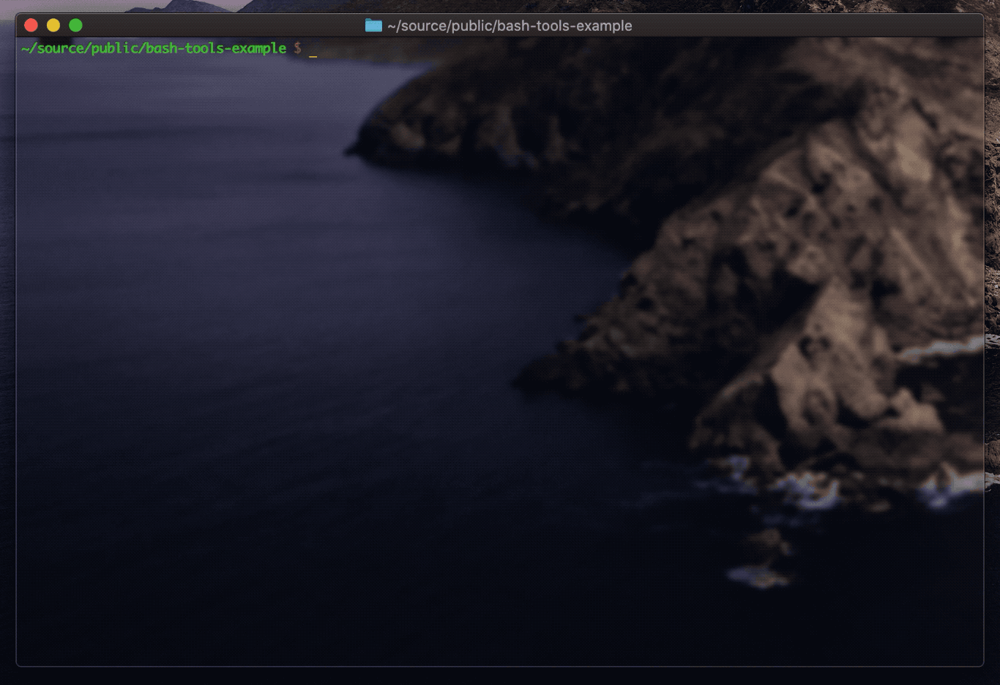

# bash-tools-example
Example project demonstrating how to create CLI tools in Bash

## Installation
* clone this repo
* `cd` into project folder

## Usage
* file scanner: `./bash-example.sh scan-files 20` (scans 20 largest files, prints log)
* log processor: `./bash-example.sh process-logs` (process logs, create .yaml / .tar.gz)
* image downloader: `./bash-example.sh get-photo` (DL NASA Picture of the Day .jpg / .json)

## Tutorial
A tutorial for this example is available [here on Medium](https://itnext.io/intro-to-bash-scripting-95c5fbc2dcef)

## Contributions
Feedback is welcome, in addition to bugfixes or corrections via PR.
A future project is planned for a Bash scripting framework, using components from this example project.

To contribute to the future Bash library, follow [@kennethreilly](https://medium.com/@kennethreilly) / [@8_bit_hacker](https://twitter.com/8_bit_hacker) for updates.

## License
This repo is provided as a template under the MIT license, available for all personal, commercial, and educational use.
Good luck hacking on Bash! 😎
